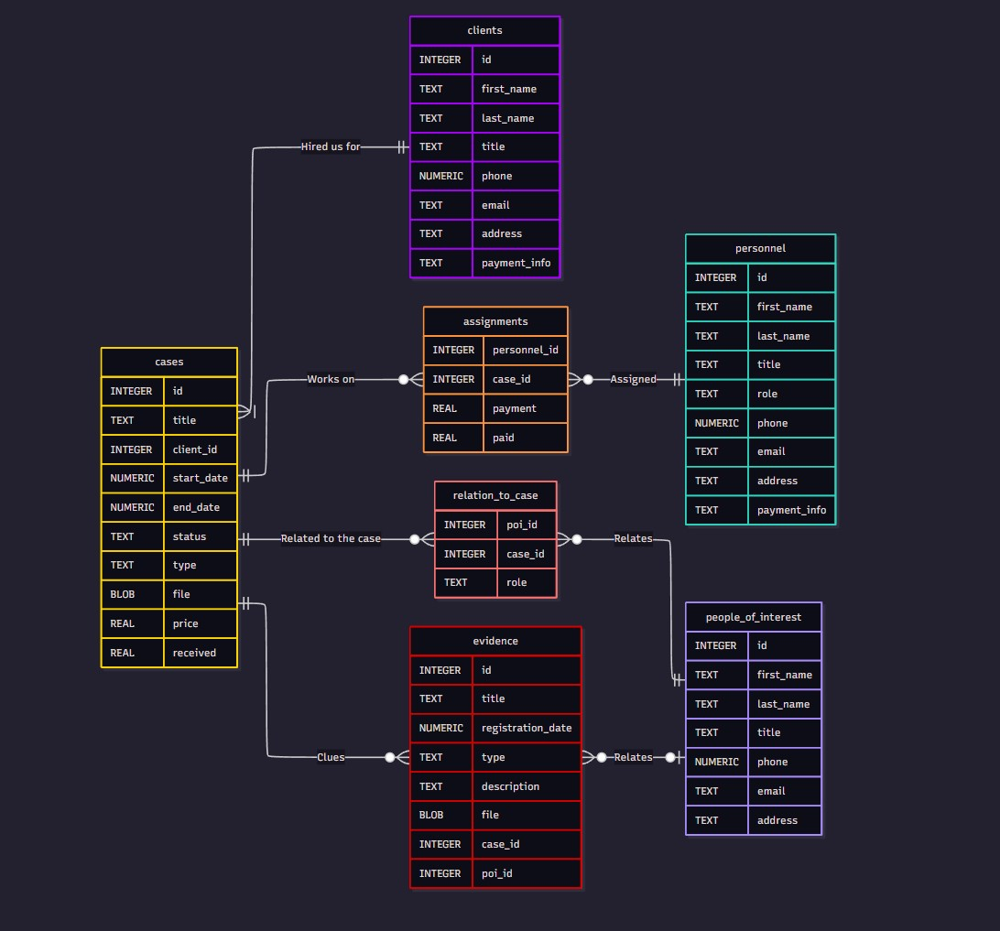

# **DESIGN DOCUMENT**


## Table of Contents

- [Scope](#scope)
- [Functional Requirements](#functional-requirements)
- [Represented Entities](#represented-entities)  
├─ [Personnel](#personnel)  
├─ [Assignments](#assignments)  
├─ [Clients](#clients)  
├─ [Cases](#cases)  
├─ [Evidence](#evidence)  
├─ [People of Interest](#people-of-interest)  
└─ [Relation to Case](#relation-to-case)  
- [Relationships](#relationships)
- [Optimizations](#optimizations)
- [Limitations](#limitations)
- [Project Structure](#project-structure)


## Scope
This databases includes all the entities necessary to keep track of the activities for a Detective Agency, including:  
* The personnel working for the agency, and their relevant information
* The cases handled by the agency, including payment information, current status, report, and client id
* The assignments for each detective and case
* The list of clients and their personal information
* A table for clues, their different types, and how they relate to a specific case or person of interest
* A list of all the people of interest that have been identified as relevant to a case
* The relationship between people of interest and specific cases


## Functional Requirements

The database will support:  
- CRUD operations for personnel, cases, assignments, clients, evidence, people of interest and relations between people of interest and the cases
- Keeping track of all the evidence and people related to a case
- Keep a record of all the personnel assignments and the payments  

The database will not support keeping track of work-related expenses

## Represented Entities

The different entities will be represented by the tables described below  

### Personnel  

The `personnel` table includes: 

* `id` - reprensents the personnal ID for each employee of the department. It is an INTEGER with PRIMARY KEY constraints.
* `first_name` - the first name of the employee, as TEXT
* `last_name` - the last name of the employee as TEXT
* `title` - specifies the employee's title (ex. 'Mr', 'Mrs') stored as TEXT
* `role` - the role of the employee in the company, or job title (ex. 'detective') stored in TEXT format
* `phone` - the employee's phone number stored as NUMERIC
* `email` - the email address of the employee, in TEXT format
* `address` - the physical address of the employee, in TEXT format
* `payment_info` - the emplyee's payment information, stored as TEXT

### Assignments

The `assignments` table includes:  

* `personnel_id` - the id of the employee for this specific assignment, as an INTEGER with the NOT NULL constraint and is a FOREIGN KEY referring to "personnel"("id")
* `case_id` - the id of the case the employee is assigned to, as an INTEGER. It has NOT NULL constraint and is a FOREIGN KEY referring to "cases"("id")
* `payment` - the amount of money owed to this employee for the assignment, stored as REAL
* `paid`  - the amount that have been paid to the employee, as a REAL with a default of 0

### Clients

The `clients` table includes:  

* `id` - the unique ID of the client, as an INTEGER with PRIMARY KEY constraint
* `first_name` - the first name of the client, as TEXT with NOT NULL constraint
* `last_name` - the client's last name as TEXT with NOT NULL constraint
* `title` - the client's title (ex. 'Mr', 'Mrs') as TEXT
* `phone` - the client's phone number, stored as NUMERIC
* `email` - the cilent's email address, as TEXT
* `address` - the client's personnal address, as TEXT
* `payment_info` - the client payment information stored as TEXT

### Cases

The `cases` table includes:  

* `id` - the unique id for this case as an INTEGER. It has the PRIMARY KEY constraint
* `title` - the name of the case (ex 'The disappearance of Mr Shark') as TEXT with the NOT NULL constraint
* `client_id` - the id of the client that hired the agency for this specific case as an INTEGER with the NOT NULL constraint. it is a FOREIGN key that references "clients"("id")
* `start_date` - the date when the case was opened, as NUMERIC with the NOT NULL constraint, and uses the CURRENT TIMESTAMP by default
* `end_date` - the daye when the case was closed, as NUMERIC
* `status` - the current status of the case with three options (Open, Resolved, or Unresolved), 'Open' is the default
* `type` - the type of the case (ex. 'murder', 'kidnapping', etc.) as TEXT
* `file` - the case file, as a BLOB
* `price` - the amount of money that the client is to pay for the current case, as a REAL
* `received` - the amount of money that the client paid so far, as REAL with a default value of 0

### Evidence

The `evidence` table includes:  

* `id` - the id of the piece of evidence, as an INTEGER. It has the PRIMARY KEY constraint.
* `title` - the name of the evidence, as TEXT with the NOT NULL constraint.
* `registration_date` - the date the evidence was registreted in the database, as NUMERIC.
* `type` - the type of evidence, as TEXT, between those options: 'Anecdotal', 'Hearsay', 'Testimonial', 'Direct'.
* `description` - a description of the evidence, as TEXT.
* `file` - the evidence file, for pictures, recordings, etc. stored as BLOB.
* `case_id` - the id of the case related to the evidence, as INTEGER with NOT NULL constraint. It is a FOREIGN KEY relating to "cases"("id").
* `poi_id` - the id of the person of interest related to this evidence as an INTEGER. Optional. It is  FOREIGN KEY relating to "people_of_interest"("id")

### People of Interest

The `people_of_interest` table includes:  

* `id` - the id of a person that has been found related to a case, as an INTEGER. It is a PRIMARY KEY.
* `first_name` - the first name of the person, as TEXT with the NOT NULL constraint.
* `last_name` - the last name of the person, as TEXT, with the NOT NULL constraint.
* `title` - the title of the person of interest (ex. 'Mr', 'Mrs', etc.).
* `phone` - the phone number of the person, stored as NUMERIC.
* `email` - the email address of the person, stored as TEXT.
* `address` - the physical address of the person, stored as TEXT.

### Relation to Case

The `relation_to_case` table includes:  

* `poi_id` - the ID of the person of interest related to the case. This is a FOREIGN KEY relating to "people_of_interest"("id").
* `case_id` - the ID of the case the person is related to. This is a FOREIGN KEY relating to "cases"("id").
* `role`  - the role the person had in the case, as TEXT. Ex. 'Victim', 'Suspect', 'Witness', etc.


## Relationships

This entity relationship diagram illustrates how the different entities are related in the database.



## Optimizations

Is it very common for users to query the database using names for people, cases, and evidence. 
As such, indexes have been created in multiple tables :
- An index for `first_name`and `last_name` in the `people_of_interest` table.
- An index for `title` in the `evidence` table.
- An index for `title` in the `cases` table.

## Limitations

- The current schema doesn't keep track of the work-related expenses during investigations. 
- It doesn't show the location of the cases (town, address).
- Could add more data for personnel, for detectives no longer working at the company.


## Project Structure

```
database/
├── DESIGN.md     # The current file, detailing the design for the database.
├── schema.sql    # A series of SQL statements to create tables, indexes, and views
├── queries.sql   # A sample of a few queries, updates, and inserts that can be done with this database
└── diagram.jpg   # The entity relationship diagram of the database
```

## License

This project is released under the MIT License.